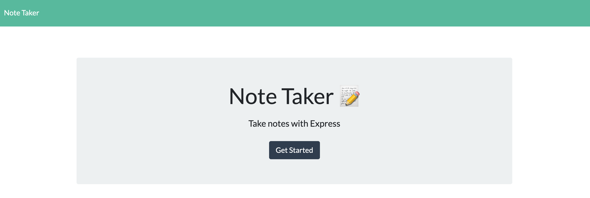
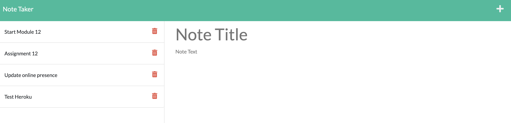

# Express Note Taker

  

## <u>Table of Contents</u>
1. [Description](#description)
2. [Installation](#installation)
3. [Usage](#usage)
4. [Contributing](#contributing)
5. [Testing](#testing)
6. [Questions](#questions)
7. [License](#license)

## Description
***

Express Note Taker is an easy to use application that utilizes Node.js and Express.js to create and deploy a live application on a server. It can either be deployed locally by running the server on your machine, or viewed on the following link: https://shrouded-earth-04058.herokuapp.com/

The application is deployed on Heroku. 

The application allows the user to write and save notes with a title section and text section, which is the body of the text. The user can also view older notes that they have saved in the past, or delete them. 

## Installation
***

To install this application get the repository link from above, either via an HTTP or SSH link. 

```
git clone 
```

Once you have the repository cloned to your local machine, navigate to the root of the repository in your terminal.

```
npm install
```

This will install all the necessary dependencies that are needed for the application to run.


## Usage
***

To use this application, navigate to the root of this repository in the terminal and enter the following command 

```
npm start
```

This will start the server and the depoyed application can be accessed on their browser via a local host. 

The user can also use the application via the Heroku link provided above.

The following images show the prompt that is displayed on the command line and a sample webapge generated using the application.

 

***




## Contributing
***

To contribute to this application, push any enhancements and changes you code and send an email to charanvir123@gmail.com. The developer will get back to you if they wish to implement any of the code changes you've made. 

## Testing
***

Testing has been implemented using the node package "Jest" Use the following command to test whether the files are correctly working. This command must be ran within the applications directory.

```
npm run test
```

There should be 1 Test Suite that is ran and passed, along with 3 individual tests that should all pass as well. 

## Questions
***
To view more projects visit this [Github](https://github.com/Charanvir) account.

Direct any additional questions you have regarding this application to charanvir123@gmail.com

## License
***
The following application is covered under the MIT License
